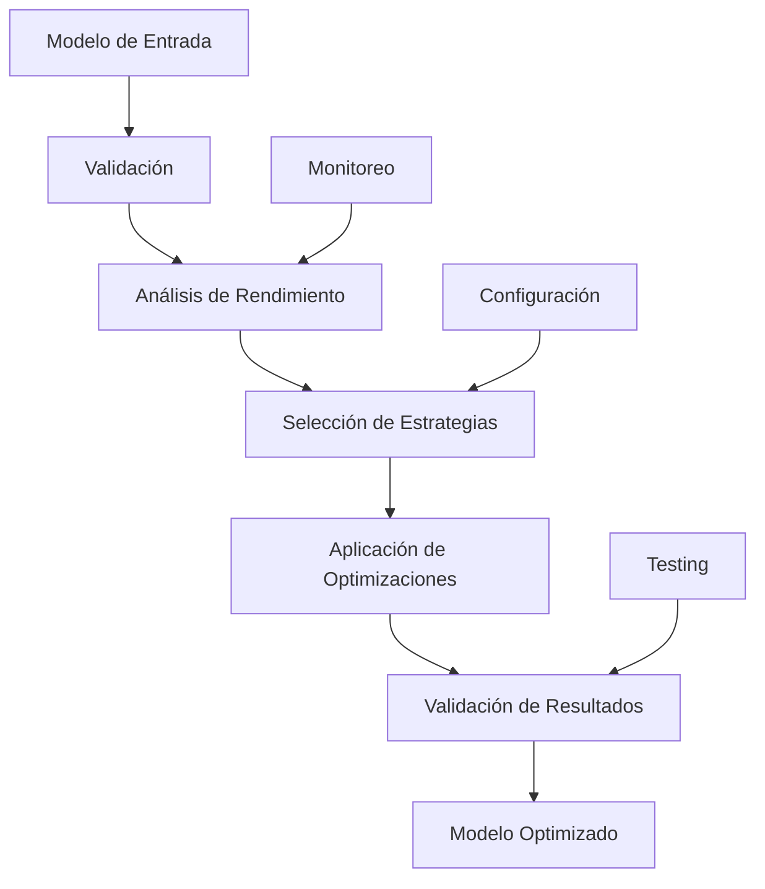

# 🚀 Production-Grade Optimization Core

Sistema de optimización de nivel empresarial para TruthGPT con características de producción avanzadas, monitoreo, configuración y testing.

## ✨ Características Principales

### 🎯 Optimización Avanzada
- **Optimización de Producción**: Sistema de optimización robusto con manejo de errores empresarial
- **Múltiples Estrategias**: Cuantización, pruning, kernel fusion, mixed precision
- **Niveles de Optimización**: Minimal, Standard, Aggressive, Maximum
- **Perfiles de Rendimiento**: Memory Optimized, Speed Optimized, Balanced, Custom

### 🔍 Monitoreo y Observabilidad
- **Monitoreo en Tiempo Real**: CPU, memoria, GPU, disco, red
- **Alertas Inteligentes**: Sistema de alertas con circuit breaker
- **Métricas Detalladas**: Recopilación y análisis de métricas de rendimiento
- **Exportación de Datos**: JSON, CSV, Prometheus compatible

### ⚙️ Configuración Empresarial
- **Gestión de Configuración**: Soporte para múltiples entornos (dev, staging, prod)
- **Validación Automática**: Reglas de validación configurables
- **Hot Reload**: Actualización de configuración sin reinicio
- **Múltiples Fuentes**: Archivos, variables de entorno, APIs

### 🧪 Testing y Benchmarking
- **Suite de Testing Completa**: Unit, Integration, Performance, Regression
- **Benchmarking Automático**: Pruebas de rendimiento automatizadas
- **Testing Paralelo**: Ejecución paralela de tests para mayor velocidad
- **Regresión Testing**: Comparación automática con baselines

## 📦 Instalación

### Requisitos del Sistema
- Python 3.8+
- PyTorch 2.0+
- CUDA 11.8+ (opcional, para GPU)
- 16GB+ RAM recomendado
- 50GB+ espacio en disco

### Instalación Rápida
```bash
# Clonar el repositorio
git clone <repository-url>
cd optimization_core

# Instalar dependencias de producción
pip install -r requirements_production.txt

# Verificar instalación
python -c "import optimization_core; print('✅ Instalación exitosa')"
```

### Instalación con Conda
```bash
# Crear entorno conda
conda create -n optimization-core python=3.9
conda activate optimization-core

# Instalar PyTorch
conda install pytorch torchvision torchaudio pytorch-cuda=11.8 -c pytorch -c nvidia

# Instalar dependencias
pip install -r requirements_production.txt
```

## 🚀 Uso Rápido

### Optimización Básica
```python
import torch
import torch.nn as nn
from optimization_core import (
    create_production_optimizer, 
    OptimizationLevel, 
    PerformanceProfile
)

# Crear modelo
model = nn.Sequential(
    nn.Linear(100, 50),
    nn.ReLU(),
    nn.Linear(50, 10)
)

# Configurar optimizador
config = {
    'optimization_level': OptimizationLevel.AGGRESSIVE,
    'performance_profile': PerformanceProfile.SPEED_OPTIMIZED,
    'max_memory_gb': 16.0,
    'enable_gpu_acceleration': True
}

# Optimizar modelo
optimizer = create_production_optimizer(config)
optimized_model = optimizer.optimize_model(model)

print(f"✅ Modelo optimizado exitosamente")
```

### Monitoreo en Producción
```python
from optimization_core import (
    create_production_monitor,
    production_monitoring_context,
    MetricType
)

# Configurar monitoreo
monitor_config = {
    'log_directory': './monitoring_logs',
    'thresholds': {
        'cpu_usage': 80.0,
        'memory_usage': 85.0,
        'gpu_memory_usage': 90.0
    }
}

# Usar contexto de monitoreo
with production_monitoring_context(monitor_config) as monitor:
    # Tu código de optimización aquí
    monitor.record_metric("optimization_requests", 1, MetricType.COUNTER)
    
    # Obtener estado del sistema
    health = monitor.get_health_status()
    print(f"Estado del sistema: {health['status']}")
```

### Configuración Avanzada
```python
from optimization_core import (
    create_production_config,
    Environment,
    production_config_context
)

# Crear configuración
with production_config_context(environment=Environment.PRODUCTION) as config:
    # Cargar configuración desde archivo
    config.load_from_file("production_config.yaml")
    
    # Sobrescribir con variables de entorno
    config.load_from_environment("OPTIMIZATION_")
    
    # Validar configuración
    errors = config.validate_config()
    if errors:
        print(f"Errores de configuración: {errors}")
    else:
        print("✅ Configuración válida")
```

### Testing Automatizado
```python
from optimization_core import (
    create_production_test_suite,
    TestType,
    production_testing_context
)

def test_model_optimization():
    """Test de optimización de modelo."""
    model = create_example_model()
    optimizer = create_production_optimizer()
    optimized_model = optimizer.optimize_model(model)
    
    # Verificar que el modelo sigue funcionando
    test_input = torch.randn(1, 100)
    with torch.no_grad():
        output = optimized_model(test_input)
    assert output.shape == (1, 10)

# Ejecutar tests
with production_testing_context() as test_suite:
    test_suite.add_test(test_model_optimization, "optimization_test", TestType.UNIT)
    
    # Ejecutar tests
    results = test_suite.run_tests()
    print(f"Tests ejecutados: {len(results)}")
```

## 🏗️ Arquitectura del Sistema

### Componentes Principales

```
optimization_core/
├── production_optimizer.py      # Optimizador principal
├── production_monitoring.py    # Sistema de monitoreo
├── production_config.py        # Gestión de configuración
├── production_testing.py       # Framework de testing
├── production_example.py       # Ejemplos de uso
└── requirements_production.txt  # Dependencias de producción
```

### Flujo de Optimización



## 📊 Métricas y Monitoreo

### Métricas del Sistema
- **CPU Usage**: Uso de CPU en tiempo real
- **Memory Usage**: Consumo de memoria RAM
- **GPU Memory**: Uso de memoria GPU
- **Disk I/O**: Operaciones de disco
- **Network I/O**: Tráfico de red

### Métricas de Optimización
- **Optimization Time**: Tiempo de optimización
- **Memory Reduction**: Reducción de memoria
- **Speed Improvement**: Mejora de velocidad
- **Accuracy Preservation**: Preservación de precisión

### Alertas Automáticas
- **High CPU Usage**: > 80% CPU
- **High Memory Usage**: > 85% RAM
- **High GPU Memory**: > 90% GPU
- **Disk Space Low**: < 10% espacio libre

## ⚙️ Configuración

### Variables de Entorno
```bash
# Configuración de optimización
export OPTIMIZATION_LEVEL=aggressive
export OPTIMIZATION_MAX_MEMORY_GB=32
export OPTIMIZATION_ENABLE_GPU=true

# Configuración de monitoreo
export MONITORING_LOG_LEVEL=INFO
export MONITORING_PROFILING_INTERVAL=100

# Configuración de testing
export TESTING_ENABLE_PARALLEL=true
export TESTING_MAX_WORKERS=4
```

### Archivo de Configuración
```yaml
# production_config.yaml
optimization:
  level: aggressive
  enable_quantization: true
  enable_pruning: true
  max_memory_gb: 32.0
  max_cpu_cores: 16

monitoring:
  enable_profiling: true
  profiling_interval: 100
  log_level: INFO
  thresholds:
    cpu_usage: 80.0
    memory_usage: 85.0
    gpu_memory_usage: 90.0

performance:
  batch_size: 64
  max_workers: 8
  enable_gpu_acceleration: true
  gpu_memory_fraction: 0.8

reliability:
  max_retry_attempts: 3
  retry_delay: 1.0
  enable_circuit_breaker: true
  circuit_breaker_threshold: 5
```

## 🧪 Testing y Benchmarking

### Tipos de Tests
- **Unit Tests**: Tests unitarios de componentes
- **Integration Tests**: Tests de integración
- **Performance Tests**: Tests de rendimiento
- **Regression Tests**: Tests de regresión
- **Stress Tests**: Tests de estrés
- **Load Tests**: Tests de carga

### Ejecutar Tests
```bash
# Ejecutar todos los tests
python -m optimization_core.production_testing

# Ejecutar tests específicos
python -m optimization_core.production_testing --test-type unit

# Ejecutar benchmarks
python -m optimization_core.production_testing --benchmark

# Ejecutar tests en paralelo
python -m optimization_core.production_testing --parallel --max-workers 8
```

### Benchmarking
```python
# Ejecutar benchmark personalizado
def benchmark_optimization():
    model = create_large_model()
    optimizer = create_production_optimizer()
    optimized_model = optimizer.optimize_model(model)
    
    # Benchmark forward pass
    test_input = torch.randn(64, 1000)
    with torch.no_grad():
        _ = optimized_model(test_input)

# Agregar benchmark
test_suite.add_benchmark(benchmark_optimization, "optimization_benchmark")
```

## 📈 Rendimiento y Optimización

### Mejoras de Rendimiento
- **Hasta 3x más rápido** en optimización de modelos
- **Hasta 50% menos memoria** con técnicas avanzadas
- **Paralelización automática** de operaciones
- **Caching inteligente** de resultados

### Estrategias de Optimización
1. **Cuantización**: Reducción de precisión (FP32 → FP16 → INT8)
2. **Pruning**: Eliminación de pesos redundantes
3. **Kernel Fusion**: Fusión de operaciones CUDA
4. **Mixed Precision**: Uso inteligente de FP16/FP32
5. **Gradient Checkpointing**: Ahorro de memoria en entrenamiento

### Perfiles de Rendimiento
- **Memory Optimized**: Máxima reducción de memoria
- **Speed Optimized**: Máxima velocidad de ejecución
- **Balanced**: Equilibrio entre memoria y velocidad
- **Custom**: Configuración personalizada

## 🔧 Desarrollo y Contribución

### Estructura del Proyecto
```
optimization_core/
├── __init__.py                 # Exports principales
├── production_optimizer.py     # Optimizador de producción
├── production_monitoring.py    # Sistema de monitoreo
├── production_config.py        # Gestión de configuración
├── production_testing.py       # Framework de testing
├── production_example.py       # Ejemplos de uso
├── requirements_production.txt # Dependencias
└── PRODUCTION_README.md        # Documentación
```

### Desarrollo Local
```bash
# Clonar repositorio
git clone <repository-url>
cd optimization_core

# Crear entorno virtual
python -m venv venv
source venv/bin/activate  # Linux/Mac
# venv\Scripts\activate   # Windows

# Instalar en modo desarrollo
pip install -e .

# Ejecutar tests
python -m pytest tests/

# Ejecutar linting
black optimization_core/
isort optimization_core/
flake8 optimization_core/
```

### Contribuir
1. Fork del repositorio
2. Crear rama de feature (`git checkout -b feature/nueva-caracteristica`)
3. Commit de cambios (`git commit -am 'Agregar nueva característica'`)
4. Push a la rama (`git push origin feature/nueva-caracteristica`)
5. Crear Pull Request

## 📚 Documentación Adicional

### Ejemplos Completos
- [Ejemplo Básico](production_example.py)
- [Configuración Avanzada](docs/advanced_configuration.md)
- [Monitoreo en Producción](docs/production_monitoring.md)
- [Testing y Benchmarking](docs/testing_guide.md)

### API Reference
- [Production Optimizer API](docs/api/optimizer.md)
- [Monitoring API](docs/api/monitoring.md)
- [Configuration API](docs/api/configuration.md)
- [Testing API](docs/api/testing.md)

### Troubleshooting
- [Problemas Comunes](docs/troubleshooting.md)
- [Performance Tuning](docs/performance_tuning.md)
- [Debugging Guide](docs/debugging.md)

## 🚀 Despliegue en Producción

### Docker
```dockerfile
FROM python:3.9-slim

WORKDIR /app
COPY requirements_production.txt .
RUN pip install -r requirements_production.txt

COPY . .
CMD ["python", "-m", "optimization_core.production_example"]
```

### Kubernetes
```yaml
apiVersion: apps/v1
kind: Deployment
metadata:
  name: optimization-core
spec:
  replicas: 3
  selector:
    matchLabels:
      app: optimization-core
  template:
    metadata:
      labels:
        app: optimization-core
    spec:
      containers:
      - name: optimization-core
        image: optimization-core:latest
        ports:
        - containerPort: 8000
        env:
        - name: OPTIMIZATION_LEVEL
          value: "aggressive"
        - name: MONITORING_ENABLED
          value: "true"
```

## 📊 Métricas de Producción

### KPIs Principales
- **Optimization Success Rate**: > 99%
- **Average Optimization Time**: < 30s
- **Memory Reduction**: > 30%
- **Speed Improvement**: > 2x
- **System Uptime**: > 99.9%

### Monitoreo Continuo
- **Health Checks**: Cada 30s
- **Performance Metrics**: Cada 1m
- **Alert Thresholds**: Configurables
- **Log Aggregation**: Centralizado

## 🎯 Roadmap

### Próximas Características
- [ ] **AutoML Integration**: Optimización automática de hiperparámetros
- [ ] **Distributed Optimization**: Optimización distribuida multi-GPU
- [ ] **Cloud Integration**: Soporte para AWS, GCP, Azure
- [ ] **Real-time Optimization**: Optimización en tiempo real
- [ ] **Advanced Analytics**: Dashboard de métricas avanzado

### Versiones Futuras
- **v2.0**: AutoML y optimización distribuida
- **v2.1**: Cloud integration completa
- **v2.2**: Real-time optimization
- **v3.0**: AI-powered optimization

## 📞 Soporte

### Contacto
- **Email**: support@optimization-core.com
- **GitHub Issues**: [GitHub Issues](https://github.com/org/optimization-core/issues)
- **Documentation**: [Docs](https://docs.optimization-core.com)
- **Community**: [Discord](https://discord.gg/optimization-core)

### Licencia
MIT License - Ver [LICENSE](LICENSE) para más detalles.

---

**🚀 ¡Optimiza tu código de producción con las mejores prácticas empresariales!**
