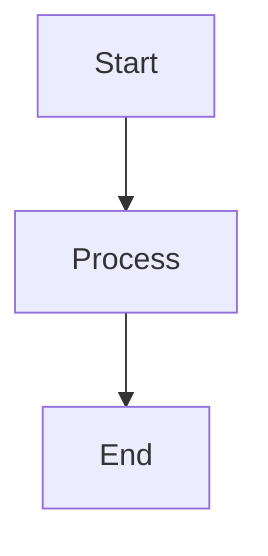

# RFC: [Title of the Feature/Change]

## Status
- **Status**: [Proposed | Accepted | Rejected | Implemented | Deprecated]
- **Author**: [Your Name/Team]
- **Date**: [YYYY-MM-DD]
- **Last Updated**: [YYYY-MM-DD]

## Summary
Brief one-paragraph summary of the RFC.

## Motivation
- Why is this change needed?
- What problems does it solve?
- What are the use cases?

## Background
- Current state of the system
- Existing solutions and their limitations
- Related issues or discussions

## Detailed Design

### Overview
High-level architecture and approach.

### Components

#### Component 1: [Name]
- **Purpose**: [Description]
- **Design Decisions**: [Key decisions]
- **API/Interface**: [If applicable]

#### Component 2: [Name]
- **Purpose**: [Description]
- **Design Decisions**: [Key decisions]
- **API/Interface**: [If applicable]

### Data Models
```python
# Example data model
class ExampleModel(BaseModel):
    field: str
    optional_field: Optional[int] = None
```

### API Changes
- New endpoints: `/api/v1/new-endpoint`
- Modified endpoints: `/api/v1/modified-endpoint`
- Deprecated endpoints: `/api/v1/old-endpoint`

### Database Changes
- New tables: `new_table`
- Schema migrations: [Description]
- Indexes: [If applicable]

### Configuration Changes
- New environment variables: `NEW_CONFIG_VAR`
- Default values: [Values]
- Required changes: [What needs to be updated]

### Security Considerations
- Authentication/Authorization changes
- Data privacy implications
- Potential security risks and mitigations

### Performance Implications
- Expected performance impact
- Bottlenecks and optimizations
- Resource requirements

### Observability
- New metrics: `new_metric_name`
- Logging changes: [Description]
- Monitoring dashboards: [If applicable]

## Alternatives Considered

### Alternative 1: [Name]
- **Pros**: [Advantages]
- **Cons**: [Disadvantages]
- **Why not chosen**: [Reason]

### Alternative 2: [Name]
- **Pros**: [Advantages]
- **Cons**: [Disadvantages]
- **Why not chosen**: [Reason]

## Implementation Plan

### Phase 1: [Name]
- [ ] Task 1
- [ ] Task 2
- **Timeline**: [Estimate]

### Phase 2: [Name]
- [ ] Task 1
- [ ] Task 2
- **Timeline**: [Estimate]

### Phase 3: [Name]
- [ ] Task 1
- [ ] Task 2
- **Timeline**: [Estimate]

## Testing Strategy

### Unit Tests
- Test coverage for new components
- Mock requirements

### Integration Tests
- End-to-end scenarios
- API contract tests

### Performance Tests
- Load testing scenarios
- Performance benchmarks

### Security Tests
- Security audit checklist
- Penetration testing requirements

## Rollout Plan

### Canary Deployment
- Percentage rollout: [X%]
- Success criteria: [Metrics]
- Rollback plan: [Steps]

### Full Deployment
- Timeline: [Date]
- Dependencies: [Other changes needed]

## Risks and Mitigations

| Risk | Impact | Probability | Mitigation |
|------|--------|-------------|------------|
| Risk 1 | High | Medium | Mitigation strategy |
| Risk 2 | Medium | Low | Mitigation strategy |

## Success Metrics

### KPIs
- Metric 1: [Target value]
- Metric 2: [Target value]

### Monitoring
- Dashboards: [Links]
- Alerts: [Configuration]

## Backward Compatibility
- Breaking changes: [List]
- Migration path: [Steps]
- Deprecation timeline: [If applicable]

## Open Questions
- [ ] Question 1
- [ ] Question 2

## References
- Related RFCs: [Links]
- External resources: [Links]
- Design documents: [Links]

## Appendix

### Example Code
```python
# Example implementation snippet
def example_function():
    pass
```

### Diagrams


## Approval
- [ ] Engineering Lead: [Name, Date]
- [ ] Security Team: [Name, Date]
- [ ] Product Manager: [Name, Date]


