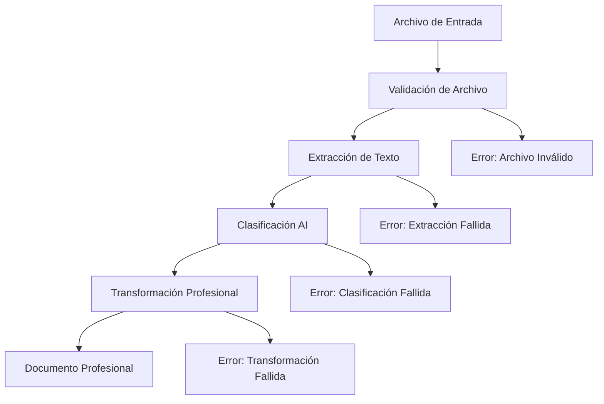

# AI Document Processor - Resumen del Sistema

## 🎯 Descripción General

El **AI Document Processor** es un sistema de IA avanzado que puede leer cualquier tipo de archivo (MD, PDF, Word) y transformarlo en un documento profesional editable como documentos de consultoría. El sistema detecta automáticamente el área de conocimiento del documento y lo transforma en un formato profesional estructurado.

## 🏗️ Arquitectura del Sistema

```
ai_document_processor/
├── main.py                    # Aplicación principal FastAPI
├── config.py                  # Configuraciones centralizadas
├── requirements.txt           # Dependencias del proyecto
├── README.md                  # Documentación completa
├── example_usage.py           # Ejemplos de uso
├── env.example               # Variables de entorno de ejemplo
├── SYSTEM_SUMMARY.md         # Este archivo
├── models/                   # Modelos de datos
│   ├── __init__.py
│   └── document_models.py    # Modelos Pydantic
├── services/                 # Servicios principales
│   ├── __init__.py
│   ├── document_processor.py # Procesador principal
│   ├── ai_classifier.py      # Clasificador AI
│   └── professional_transformer.py # Transformador profesional
├── utils/                    # Utilidades
│   ├── __init__.py
│   └── file_handlers.py      # Manejadores de archivos
├── templates/                # Plantillas (futuro)
└── tests/                    # Pruebas (futuro)
```

## 🔧 Componentes Principales

### 1. **DocumentProcessor** (`services/document_processor.py`)
- **Función**: Coordina el procesamiento completo de documentos
- **Características**:
  - Extracción de texto de múltiples formatos
  - Validación de archivos
  - Coordinación entre clasificador y transformador
  - Manejo de errores y timeouts

### 2. **AIClassifier** (`services/ai_classifier.py`)
- **Función**: Clasifica documentos por área y tipo usando IA
- **Métodos de clasificación**:
  - **Patrones de palabras clave**: Análisis basado en términos específicos
  - **OpenAI GPT**: Clasificación inteligente usando IA
  - **Machine Learning**: Modelos entrenados (futuro)
- **Áreas soportadas**: Business, Technology, Academic, Legal, Medical, Finance, Marketing, Education

### 3. **ProfessionalTransformer** (`services/professional_transformer.py`)
- **Función**: Transforma documentos en formatos profesionales
- **Formatos de salida**:
  - **Consultoría**: Informes de consultoría empresarial
  - **Técnico**: Documentación técnica profesional
  - **Académico**: Documentos académicos y de investigación
  - **Comercial**: Documentos comerciales y de marketing
  - **Legal**: Documentos legales y contractuales

### 4. **FileHandlers** (`utils/file_handlers.py`)
- **Función**: Extrae texto de diferentes formatos de archivo
- **Formatos soportados**:
  - **Markdown (.md)**: Conversión a texto plano
  - **PDF (.pdf)**: Extracción con pdfplumber, PyPDF2, PyMuPDF
  - **Word (.docx, .doc)**: Extracción con python-docx, docx2txt
  - **Texto (.txt)**: Lectura directa con detección de codificación

## 📊 Modelos de Datos

### **DocumentAnalysis**
```python
{
    "filename": str,
    "document_type": DocumentType,
    "area": DocumentArea,
    "category": DocumentCategory,
    "confidence": float,
    "language": str,
    "word_count": int,
    "key_topics": List[str],
    "summary": str,
    "metadata": Dict[str, Any]
}
```

### **ProfessionalDocument**
```python
{
    "title": str,
    "format": ProfessionalFormat,
    "language": str,
    "content": str,
    "structure": Dict[str, Any],
    "sections": List[Dict[str, Any]],
    "metadata": Dict[str, Any],
    "original_analysis": DocumentAnalysis
}
```

## 🚀 API Endpoints

### **POST** `/ai-document-processor/process`
- **Función**: Procesa un documento completo
- **Parámetros**: `file`, `target_format`, `language`
- **Respuesta**: Documento profesional transformado + análisis

### **POST** `/ai-document-processor/classify`
- **Función**: Clasifica un documento
- **Parámetros**: `file`
- **Respuesta**: Análisis de clasificación

### **POST** `/ai-document-processor/transform`
- **Función**: Transforma texto en documento profesional
- **Parámetros**: `text`, `target_format`, `language`
- **Respuesta**: Documento profesional

### **GET** `/ai-document-processor/health`
- **Función**: Verificación de salud del servicio
- **Respuesta**: Estado del sistema

### **GET** `/ai-document-processor/supported-formats`
- **Función**: Obtiene formatos soportados
- **Respuesta**: Lista de formatos de entrada y salida

## 🔄 Flujo de Procesamiento



## 🎯 Características Destacadas

### **1. Multi-formato**
- Soporte para MD, PDF, Word, TXT
- Extracción robusta con múltiples bibliotecas
- Manejo de errores y fallbacks

### **2. Clasificación Inteligente**
- Múltiples métodos de clasificación
- Detección automática de área de conocimiento
- Análisis de confianza y alternativas

### **3. Transformación Profesional**
- 5 formatos profesionales diferentes
- Plantillas estructuradas
- Generación con IA (OpenAI) o básica

### **4. API REST Completa**
- Endpoints bien documentados
- Manejo de errores robusto
- Respuestas estructuradas

### **5. Configuración Flexible**
- Variables de entorno
- Configuraciones por formato
- Parámetros ajustables

## 🛠️ Tecnologías Utilizadas

### **Backend**
- **FastAPI**: Framework web moderno y rápido
- **Pydantic**: Validación de datos y modelos
- **Uvicorn**: Servidor ASGI

### **IA y ML**
- **OpenAI GPT**: Clasificación y transformación inteligente
- **scikit-learn**: Machine learning (futuro)
- **NLTK/Spacy**: Procesamiento de lenguaje natural

### **Procesamiento de Documentos**
- **python-docx**: Documentos Word
- **PyPDF2/pdfplumber**: Documentos PDF
- **markdown**: Documentos Markdown
- **pymupdf**: PDF avanzado

### **Utilidades**
- **asyncio**: Programación asíncrona
- **pathlib**: Manejo de rutas
- **tempfile**: Archivos temporales
- **logging**: Sistema de logs

## 📈 Métricas y Rendimiento

### **Límites de Archivo**
- **Tamaño máximo**: 50MB
- **Texto máximo**: 100,000 caracteres
- **Timeout de procesamiento**: 5 minutos

### **Formatos Soportados**
- **Markdown**: Hasta 10MB
- **PDF**: Hasta 50MB
- **Word**: Hasta 25MB
- **Texto**: Hasta 5MB

### **Rendimiento**
- **Procesamiento concurrente**: 10 requests
- **Cache TTL**: 1 hora
- **Rate limiting**: 60 requests/minuto

## 🔒 Seguridad

### **Validación de Archivos**
- Verificación de extensiones
- Límites de tamaño
- Filtrado de archivos peligrosos

### **Autenticación**
- JWT tokens (configurable)
- CORS configurable
- Rate limiting

### **Datos**
- Archivos temporales limpiados automáticamente
- Logs sin información sensible
- Configuración por variables de entorno

## 🚀 Instalación y Uso

### **Instalación Rápida**
```bash
cd ai_document_processor
pip install -r requirements.txt
cp env.example .env
# Configurar OPENAI_API_KEY en .env
python main.py
```

### **Uso Básico**
```bash
# Procesar documento
curl -X POST "http://localhost:8001/ai-document-processor/process" \
  -F "file=@documento.pdf" \
  -F "target_format=consultancy" \
  -F "language=es"
```

### **Ejemplo Python**
```python
from services.document_processor import DocumentProcessor
from models.document_models import DocumentProcessingRequest, ProfessionalFormat

processor = DocumentProcessor()
await processor.initialize()

request = DocumentProcessingRequest(
    filename="documento.pdf",
    target_format=ProfessionalFormat.CONSULTANCY,
    language="es"
)

result = await processor.process_document("documento.pdf", request)
```

## 🔮 Roadmap Futuro

### **Corto Plazo**
- [ ] Interfaz web
- [ ] Procesamiento en lote
- [ ] Más formatos (PowerPoint, Excel)
- [ ] Plantillas personalizables

### **Mediano Plazo**
- [ ] Base de datos para historial
- [ ] Análisis de sentimientos
- [ ] Extracción de entidades
- [ ] Traducción automática

### **Largo Plazo**
- [ ] Machine learning personalizado
- [ ] Integración con sistemas empresariales
- [ ] API GraphQL
- [ ] Microservicios distribuidos

## 📞 Soporte

- **Documentación**: README.md completo
- **Ejemplos**: example_usage.py
- **API Docs**: http://localhost:8001/docs
- **Logs**: Sistema de logging integrado

---

**Versión**: 1.0.0  
**Autor**: Blatam Academy  
**Fecha**: 2025  
**Licencia**: MIT


