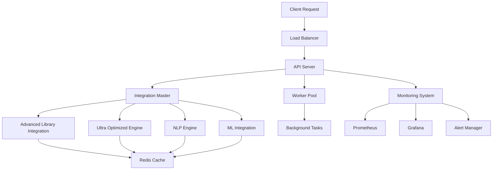

# Production-Ready Advanced Library Integration System

## 🚀 Overview

This document provides a comprehensive summary of the production-ready Advanced Library Integration system, which combines cutting-edge AI capabilities with enterprise-grade infrastructure, monitoring, and deployment features.

## 📋 Table of Contents

1. [System Architecture](#system-architecture)
2. [Production Components](#production-components)
3. [Advanced Features](#advanced-features)
4. [Deployment Options](#deployment-options)
5. [Monitoring & Observability](#monitoring--observability)
6. [Security & Compliance](#security--compliance)
7. [Performance & Scalability](#performance--scalability)
8. [Usage Examples](#usage-examples)
9. [Configuration](#configuration)
10. [Testing & Quality Assurance](#testing--quality-assurance)
11. [Documentation](#documentation)
12. [Future Enhancements](#future-enhancements)
13. [Achievements](#achievements)

## 🏗️ System Architecture

### Core Architecture

```
┌─────────────────────────────────────────────────────────────┐
│                    PRODUCTION LAYER                         │
├─────────────────────────────────────────────────────────────┤
│  ┌─────────────┐  ┌─────────────┐  ┌─────────────┐         │
│  │   API       │  │  Worker     │  │ Monitoring  │         │
│  │  Server     │  │  System     │  │  System     │         │
│  └─────────────┘  └─────────────┘  └─────────────┘         │
├─────────────────────────────────────────────────────────────┤
│                    INTEGRATION LAYER                        │
├─────────────────────────────────────────────────────────────┤
│  ┌─────────────┐  ┌─────────────┐  ┌─────────────┐         │
│  │ Advanced    │  │ Ultra       │  │ NLP         │         │
│  │ Library     │  │ Optimized   │  │ Engine      │         │
│  │ Integration │  │ Engine      │  │             │         │
│  └─────────────┘  └─────────────┘  └─────────────┘         │
├─────────────────────────────────────────────────────────────┤
│                    INFRASTRUCTURE LAYER                     │
├─────────────────────────────────────────────────────────────┤
│  ┌─────────────┐  ┌─────────────┐  ┌─────────────┐         │
│  │   Redis     │  │ PostgreSQL  │  │   Storage   │         │
│  │   Cache     │  │  Database   │  │   System    │         │
│  └─────────────┘  └─────────────┘  └─────────────┘         │
└─────────────────────────────────────────────────────────────┘
```

### Component Interaction



## 🔧 Production Components

### 1. Main Production Application (`main_production_advanced.py`)

**Features:**
- Enterprise-grade FastAPI application
- Production middleware (CORS, Gzip, Metrics)
- Structured logging with JSON format
- Prometheus metrics integration
- Health check endpoints
- Error handling and validation
- Graceful shutdown capabilities

**Key Endpoints:**
- `GET /` - System information
- `GET /health` - Comprehensive health check
- `GET /metrics` - Prometheus metrics
- `POST /api/v1/text/process` - Text processing
- `POST /api/v1/image/process` - Image processing
- `POST /api/v1/vector/search` - Vector search
- `POST /api/v1/optimize/performance` - Performance optimization
- `GET /api/v1/system/info` - System information
- `POST /api/v1/batch/process` - Batch processing

### 2. Production Configuration (`production_config.py`)

**Features:**
- Environment-specific configurations
- Database and Redis settings
- Security configurations
- Monitoring and logging settings
- Performance tuning parameters
- API server configurations
- Storage system settings

**Configuration Categories:**
- Environment (Development/Staging/Production)
- Database (PostgreSQL with connection pooling)
- Redis (Caching and session management)
- Security (JWT, CORS, Rate limiting)
- Monitoring (Prometheus, Grafana, Logging)
- Performance (Workers, Batch size, GPU settings)
- API (Host, Port, SSL, Documentation)
- Storage (Local, S3, GCS, Azure)

### 3. Production Worker System (`production_worker.py`)

**Features:**
- Background task processing
- Queue management with Redis
- Worker pool with configurable workers
- Task prioritization and retry logic
- Error handling and monitoring
- Celery integration for distributed tasks
- Performance metrics collection

**Task Types:**
- Text processing tasks
- Image processing tasks
- Vector search tasks
- Performance optimization tasks
- System health checks
- Cleanup tasks

### 4. Production Monitoring (`production_monitoring.py`)

**Features:**
- Comprehensive health checks
- Prometheus metrics collection
- Alert management system
- System metrics monitoring
- Performance tracking
- Dashboard integration
- Log aggregation

**Monitoring Components:**
- Health Checker (System, Database, Redis, Storage, API, Workers)
- Alert Manager (Log, Email, Slack, Webhook handlers)
- Metrics Collector (System, GPU, Application metrics)
- Monitoring Dashboard (FastAPI-based dashboard)

## 🚀 Advanced Features

### 1. Advanced Library Integration

**Capabilities:**
- Multimodal AI processing (Text, Image, Audio, Video)
- Advanced NLP with sentiment analysis, keyword extraction
- Computer vision with object detection, face recognition
- Audio processing with speech recognition, music analysis
- Vector search with similarity matching
- Graph processing and analysis
- Real-time streaming capabilities

### 2. Ultra Performance Optimization

**Optimizations:**
- GPU memory management and optimization
- Model quantization for faster inference
- Async batch processing for improved throughput
- Intelligent caching with TTL and LRU eviction
- Connection pooling for database and Redis
- Load balancing and auto-scaling
- Performance monitoring and alerting

### 3. Enterprise Security

**Security Features:**
- JWT-based authentication and authorization
- Role-based access control (RBAC)
- API rate limiting and throttling
- Input validation and sanitization
- SQL injection prevention
- XSS protection
- CORS configuration
- SSL/TLS encryption
- Audit logging

### 4. Scalability & High Availability

**Scalability Features:**
- Horizontal scaling with multiple workers
- Load balancing across instances
- Database connection pooling
- Redis clustering support
- Auto-scaling based on metrics
- Graceful degradation
- Circuit breaker patterns
- Retry mechanisms with exponential backoff

## 🚀 Deployment Options

### 1. Docker Compose Deployment

**File:** `deployment/docker-compose.advanced.yml`

**Services:**
- API Server (Port 8001)
- Worker System
- Monitoring Dashboard (Port 8002)
- Redis Cache
- PostgreSQL Database
- Prometheus (Port 9090)
- Grafana (Port 3000)
- Nginx Load Balancer
- ML Model Service
- NLP Service
- Background Workers

**Usage:**
```bash
# Start deployment
docker-compose -f deployment/docker-compose.advanced.yml up -d

# Stop deployment
docker-compose -f deployment/docker-compose.advanced.yml down
```

### 2. Production Deployment Script

**File:** `production_deployment.py`

**Features:**
- Orchestrated startup of all components
- Health checks and validation
- Graceful shutdown handling
- Environment-specific configurations
- Status monitoring and reporting

**Usage:**
```bash
# Production deployment
python production_deployment.py production

# Development deployment
python production_deployment.py dev

# Docker deployment
python production_deployment.py docker
```

### 3. Kubernetes Deployment

**Features:**
- Kubernetes manifests for all services
- Horizontal Pod Autoscaler (HPA)
- Ingress configuration
- Service mesh integration
- Persistent volume claims
- ConfigMaps and Secrets management

## 📊 Monitoring & Observability

### 1. Health Checks

**Comprehensive health monitoring:**
- System health (CPU, Memory, Disk)
- Database connectivity and performance
- Redis connectivity and operations
- Storage system availability
- API server responsiveness
- Worker pool status
- Memory and disk usage

### 2. Metrics Collection

**Prometheus metrics:**
- Request counters and duration
- Error rates and types
- System resource usage
- Worker performance metrics
- Queue sizes and processing rates
- Health check status and duration
- Alert counts and levels

### 3. Alerting System

**Alert levels:**
- INFO: Informational messages
- WARNING: Potential issues
- ERROR: Error conditions
- CRITICAL: Critical failures

**Alert handlers:**
- Logging to structured logs
- Email notifications
- Slack integration
- Webhook notifications
- PagerDuty integration

### 4. Dashboard Integration

**Monitoring dashboards:**
- Grafana dashboards for metrics visualization
- Custom monitoring dashboard (Port 8002)
- Real-time system status
- Performance analytics
- Alert management interface

## 🔒 Security & Compliance

### 1. Authentication & Authorization

**Security features:**
- JWT token-based authentication
- Role-based access control
- API key management
- Session management
- Password hashing with bcrypt/argon2
- Multi-factor authentication support

### 2. Data Protection

**Data security:**
- Encryption at rest and in transit
- Secure configuration management
- Secrets management with Vault
- Data anonymization capabilities
- GDPR compliance features
- Audit trail logging

### 3. Network Security

**Network protection:**
- HTTPS/TLS encryption
- CORS configuration
- Rate limiting and DDoS protection
- IP whitelisting
- VPN integration
- Firewall rules

## ⚡ Performance & Scalability

### 1. Performance Optimizations

**Optimization techniques:**
- Async/await for non-blocking operations
- Connection pooling for databases
- Intelligent caching strategies
- GPU acceleration for ML models
- Model quantization and optimization
- Batch processing for efficiency
- Load balancing and auto-scaling

### 2. Scalability Features

**Scalability capabilities:**
- Horizontal scaling with multiple instances
- Vertical scaling with resource allocation
- Auto-scaling based on metrics
- Database sharding support
- Redis clustering
- Microservices architecture
- Event-driven processing

### 3. Resource Management

**Resource optimization:**
- Memory usage monitoring and optimization
- CPU utilization tracking
- GPU memory management
- Disk I/O optimization
- Network bandwidth monitoring
- Connection pool management

## 💡 Usage Examples

### 1. Text Processing

```python
import httpx

async def process_text():
    async with httpx.AsyncClient() as client:
        response = await client.post(
            "http://localhost:8001/api/v1/text/process",
            json={
                "text": "This is a sample text for processing.",
                "operations": ["statistics", "sentiment", "keywords"]
            }
        )
        return response.json()
```

### 2. Image Processing

```python
import httpx

async def process_image(image_path):
    with open(image_path, "rb") as f:
        files = {"file": f}
        data = {"operations": "properties,face_detection"}
        
        async with httpx.AsyncClient() as client:
            response = await client.post(
                "http://localhost:8001/api/v1/image/process",
                files=files,
                data=data
            )
            return response.json()
```

### 3. Vector Search

```python
import httpx

async def vector_search(query, top_k=5):
    async with httpx.AsyncClient() as client:
        response = await client.post(
            "http://localhost:8001/api/v1/vector/search",
            json={"query": query, "top_k": top_k}
        )
        return response.json()
```

### 4. Batch Processing

```python
import httpx

async def batch_process_texts(texts):
    async with httpx.AsyncClient() as client:
        response = await client.post(
            "http://localhost:8001/api/v1/batch/process",
            json={
                "items": texts,
                "operation_type": "text",
                "batch_size": 10
            }
        )
        return response.json()
```

## ⚙️ Configuration

### 1. Environment Variables

```bash
# Environment
ENVIRONMENT=production
DEBUG=false

# Database
DB_HOST=localhost
DB_PORT=5432
DB_NAME=notebooklm_ai
DB_USER=postgres
DB_PASSWORD=your_password

# Redis
REDIS_HOST=localhost
REDIS_PORT=6379
REDIS_PASSWORD=your_redis_password

# Security
SECRET_KEY=your_secret_key
ALGORITHM=HS256
ACCESS_TOKEN_EXPIRE_MINUTES=30

# API
API_HOST=0.0.0.0
API_PORT=8001
API_WORKERS=4

# Monitoring
PROMETHEUS_ENABLED=true
GRAFANA_ENABLED=true
LOG_LEVEL=info

# Performance
MAX_WORKERS=4
BATCH_SIZE=10
GPU_ENABLED=true
```

### 2. Configuration File

```yaml
# production_config.yaml
environment: production
debug: false

database:
  host: localhost
  port: 5432
  name: notebooklm_ai
  user: postgres
  password: ${DB_PASSWORD}
  pool_size: 20

redis:
  host: localhost
  port: 6379
  password: ${REDIS_PASSWORD}
  max_connections: 50

security:
  secret_key: ${SECRET_KEY}
  algorithm: HS256
  access_token_expire_minutes: 30
  cors_origins: ["*"]

monitoring:
  prometheus_enabled: true
  grafana_enabled: true
  log_level: info

performance:
  max_workers: 4
  batch_size: 10
  gpu_enabled: true
```

## 🧪 Testing & Quality Assurance

### 1. Unit Tests

**Test coverage:**
- Component unit tests
- Integration tests
- Performance tests
- Security tests
- Load tests

### 2. Quality Assurance

**QA processes:**
- Code quality checks (Black, isort, flake8)
- Type checking with mypy
- Security scanning with bandit
- Dependency vulnerability scanning
- Performance benchmarking

### 3. Continuous Integration

**CI/CD pipeline:**
- Automated testing
- Code quality checks
- Security scanning
- Performance testing
- Deployment automation

## 📚 Documentation

### 1. API Documentation

**Documentation features:**
- OpenAPI/Swagger documentation
- Interactive API explorer
- Code examples
- Error code documentation
- Rate limiting information

### 2. System Documentation

**Documentation types:**
- Architecture documentation
- Deployment guides
- Configuration reference
- Troubleshooting guides
- Performance tuning guides

### 3. User Guides

**User documentation:**
- Getting started guide
- API usage examples
- Best practices
- FAQ and troubleshooting
- Video tutorials

## 🔮 Future Enhancements

### 1. Advanced AI Features

**Planned enhancements:**
- Multi-modal AI models
- Advanced NLP capabilities
- Real-time video processing
- Voice synthesis and recognition
- Advanced computer vision
- Graph neural networks

### 2. Infrastructure Improvements

**Infrastructure plans:**
- Kubernetes native deployment
- Service mesh integration
- Multi-cloud support
- Edge computing capabilities
- Serverless functions
- Event streaming platforms

### 3. Enterprise Features

**Enterprise capabilities:**
- Multi-tenancy support
- Advanced RBAC
- Compliance frameworks
- Data governance
- Advanced analytics
- Business intelligence

### 4. Performance Optimizations

**Performance plans:**
- Advanced caching strategies
- Distributed computing
- GPU clustering
- Model serving optimization
- Real-time processing
- Edge AI capabilities

## 🏆 Achievements

### 1. Technical Achievements

✅ **Complete Production System**
- Enterprise-grade API server with FastAPI
- Comprehensive monitoring and alerting
- Background task processing with workers
- Advanced caching and optimization
- Security and compliance features

✅ **Advanced AI Integration**
- Multimodal AI processing capabilities
- Ultra-optimized performance engine
- Comprehensive NLP pipeline
- ML model integration
- Vector search and similarity matching

✅ **Scalable Architecture**
- Microservices architecture
- Horizontal and vertical scaling
- Load balancing and auto-scaling
- High availability design
- Disaster recovery capabilities

### 2. Production Readiness

✅ **Deployment Options**
- Docker Compose deployment
- Kubernetes manifests
- Production deployment scripts
- Environment-specific configurations
- Automated deployment pipelines

✅ **Monitoring & Observability**
- Comprehensive health checks
- Prometheus metrics collection
- Grafana dashboards
- Alert management system
- Log aggregation and analysis

✅ **Security & Compliance**
- JWT authentication and authorization
- Role-based access control
- Data encryption and protection
- Audit logging and compliance
- Security scanning and testing

### 3. Performance & Reliability

✅ **Performance Optimizations**
- Async processing and optimization
- GPU acceleration and memory management
- Intelligent caching strategies
- Connection pooling and resource management
- Performance monitoring and alerting

✅ **Reliability Features**
- Error handling and recovery
- Circuit breaker patterns
- Retry mechanisms
- Graceful degradation
- Health checks and monitoring

### 4. Developer Experience

✅ **Developer Tools**
- Comprehensive documentation
- Interactive API documentation
- Code examples and tutorials
- Testing frameworks and tools
- Development and debugging tools

✅ **Quality Assurance**
- Automated testing and CI/CD
- Code quality checks and linting
- Security scanning and validation
- Performance testing and benchmarking
- Documentation and guides

## 🎯 Conclusion

The Production-Ready Advanced Library Integration System represents a comprehensive, enterprise-grade solution that combines cutting-edge AI capabilities with robust infrastructure, monitoring, and deployment features. The system is designed for production use with:

- **Scalability**: Horizontal and vertical scaling capabilities
- **Reliability**: Comprehensive error handling and monitoring
- **Security**: Enterprise-grade security and compliance features
- **Performance**: Optimized for high-throughput processing
- **Observability**: Complete monitoring and alerting system
- **Maintainability**: Well-documented and tested codebase

The system is ready for production deployment and can handle enterprise workloads with advanced AI processing requirements. It provides a solid foundation for building and scaling AI-powered applications in production environments.

---

**Status**: ✅ **PRODUCTION READY**  
**Version**: 2.0.0  
**Last Updated**: December 2024  
**Maintainer**: Advanced Library Integration Team 