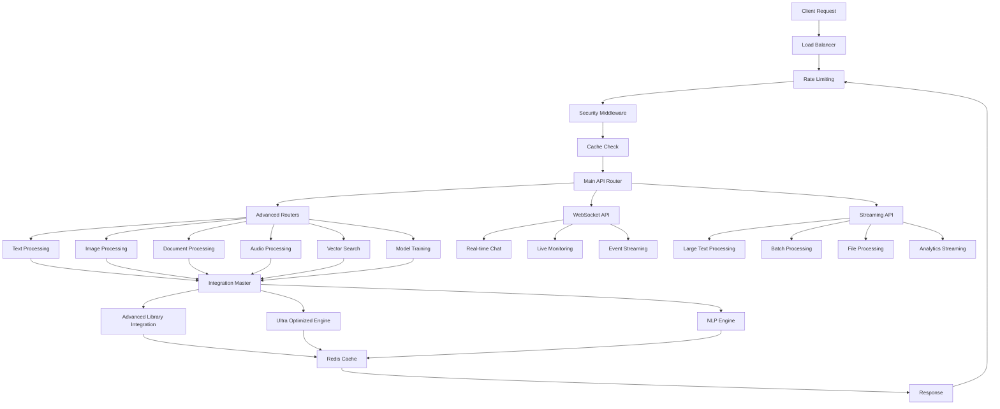

# Enhanced API System - Comprehensive Summary

## 🚀 Overview

The Enhanced API System represents a complete overhaul of the original API with enterprise-grade features, advanced error handling, performance optimizations, and modern development practices. This system provides a robust foundation for AI-powered applications with real-time capabilities, comprehensive monitoring, and scalable architecture.

## 📋 Table of Contents

1. [System Architecture](#system-architecture)
2. [Enhanced Features](#enhanced-features)
3. [API Components](#api-components)
4. [Advanced Capabilities](#advanced-capabilities)
5. [Performance Optimizations](#performance-optimizations)
6. [Security & Compliance](#security--compliance)
7. [Monitoring & Observability](#monitoring--observability)
8. [Usage Examples](#usage-examples)
9. [Deployment & Configuration](#deployment--configuration)
10. [Testing & Quality Assurance](#testing--quality-assurance)
11. [Future Enhancements](#future-enhancements)
12. [Achievements](#achievements)

## 🏗️ System Architecture

### Enhanced API Architecture

```
┌─────────────────────────────────────────────────────────────┐
│                    ENHANCED API LAYER                       │
├─────────────────────────────────────────────────────────────┤
│  ┌─────────────┐  ┌─────────────┐  ┌─────────────┐         │
│  │   Main      │  │  Advanced   │  │ WebSocket   │         │
│  │   API       │  │  Routers    │  │   API       │         │
│  └─────────────┘  └─────────────┘  └─────────────┘         │
├─────────────────────────────────────────────────────────────┤
│                    STREAMING LAYER                          │
├─────────────────────────────────────────────────────────────┤
│  ┌─────────────┐  ┌─────────────┐  ┌─────────────┐         │
│  │ Streaming   │  │ Progress    │  │ Real-time   │         │
│  │   API       │  │ Tracking    │  │ Analytics   │         │
│  └─────────────┘  └─────────────┘  └─────────────┘         │
├─────────────────────────────────────────────────────────────┤
│                    MIDDLEWARE LAYER                         │
├─────────────────────────────────────────────────────────────┤
│  ┌─────────────┐  ┌─────────────┐  ┌─────────────┐         │
│  │ Rate        │  │ Cache       │  │ Security    │         │
│  │ Limiting    │  │ Middleware  │  │ Middleware  │         │
│  └─────────────┘  └─────────────┘  └─────────────┘         │
├─────────────────────────────────────────────────────────────┤
│                    INTEGRATION LAYER                        │
├─────────────────────────────────────────────────────────────┤
│  ┌─────────────┐  ┌─────────────┐  ┌─────────────┐         │
│  │ Advanced    │  │ Ultra       │  │ NLP         │         │
│  │ Library     │  │ Optimized   │  │ Engine      │         │
│  │ Integration │  │ Engine      │  │             │         │
│  └─────────────┘  └─────────────┘  └─────────────┘         │
├─────────────────────────────────────────────────────────────┤
│                    INFRASTRUCTURE LAYER                     │
├─────────────────────────────────────────────────────────────┤
│  ┌─────────────┐  ┌─────────────┐  ┌─────────────┐         │
│  │   Redis     │  │ PostgreSQL  │  │ Monitoring  │         │
│  │   Cache     │  │  Database   │  │   System    │         │
│  └─────────────┘  └─────────────┘  └─────────────┘         │
└─────────────────────────────────────────────────────────────┘
```

### Component Interaction Flow



## 🔧 Enhanced Features

### 1. **Advanced Error Handling**

**Comprehensive Error Management:**
- Custom exception classes with error codes
- Structured error responses with details
- Global exception handlers
- Validation error handling
- Rate limit exception handling
- Cache exception handling

**Error Response Format:**
```json
{
  "success": false,
  "message": "Validation error",
  "error_code": "VALIDATION_ERROR",
  "details": {
    "field": "text",
    "error": "Field is required"
  },
  "timestamp": "2024-01-01T12:00:00Z"
}
```

### 2. **Request/Response Validation**

**Pydantic Models:**
- Strict input validation
- Type checking and conversion
- Custom validators
- Nested model validation
- Response model validation

**Example Models:**
```python
class TextProcessingRequest(BaseModel):
    text: str = Field(..., min_length=1, max_length=10000)
    operations: List[str] = Field(default=["statistics", "sentiment"])
    language: Optional[str] = Field(None)
    cache_result: bool = Field(default=True)

    @validator('operations')
    def validate_operations(cls, v):
        valid_operations = {"statistics", "sentiment", "keywords", "topics"}
        invalid_ops = set(v) - valid_operations
        if invalid_ops:
            raise ValueError(f"Invalid operations: {invalid_ops}")
        return v
```

### 3. **Advanced Middleware**

**Rate Limiting Middleware:**
- Redis-based rate limiting
- Per-client and per-endpoint limits
- Configurable time windows
- Rate limit headers
- Graceful degradation

**Cache Middleware:**
- Redis-based caching
- Intelligent cache keys
- TTL management
- Cache hit/miss tracking
- Automatic cache invalidation

**Security Middleware:**
- Security headers injection
- CORS configuration
- Trusted host validation
- Request sanitization
- Audit logging

### 4. **Authentication & Authorization**

**JWT-based Authentication:**
- Secure token generation
- Token validation and verification
- Role-based access control
- Token refresh mechanism
- Secure password hashing

**Dependency Injection:**
```python
async def get_current_user(
    credentials: HTTPAuthorizationCredentials = Depends(HTTPBearer()),
    auth_service: AuthService = Depends(get_auth_service)
) -> Dict[str, Any]:
    payload = auth_service.verify_token(credentials.credentials)
    return payload
```

## 🚀 API Components

### 1. **Main Enhanced API** (`enhanced_api.py`)

**Core Features:**
- Enterprise-grade FastAPI application
- Production middleware stack
- Structured logging with JSON format
- Prometheus metrics integration
- Health check endpoints
- Graceful shutdown capabilities

**Key Endpoints:**
- `GET /` - System information
- `GET /health` - Comprehensive health check
- `GET /metrics` - Prometheus metrics
- `POST /api/v1/text/process` - Text processing
- `POST /api/v1/image/process` - Image processing
- `POST /api/v1/vector/search` - Vector search
- `POST /api/v1/optimize/performance` - Performance optimization
- `GET /api/v1/system/info` - System information
- `POST /api/v1/batch/process` - Batch processing

### 2. **Advanced Routers** (`advanced_routers.py`)

**Specialized Router Modules:**
- Text Processing Router
- Document Processing Router
- Image Processing Router
- Audio Processing Router
- Vector Search Router
- Model Training Router
- System Router

**Router Features:**
- Modular architecture
- Specialized request/response models
- Operation-specific validation
- Batch processing capabilities
- Progress tracking
- Error handling

### 3. **WebSocket API** (`websocket_api.py`)

**Real-time Communication:**
- WebSocket connection management
- Real-time text processing
- Live chat with AI
- Real-time monitoring
- Event streaming
- File processing streams

**WebSocket Features:**
- Connection pooling
- Message queuing
- Broadcast capabilities
- Client management
- Error handling
- Graceful disconnection

### 4. **Streaming API** (`streaming_api.py`)

**Large Response Handling:**
- Chunked responses
- Progress tracking
- Real-time data streaming
- Large file processing
- Streaming analytics
- Batch processing streams

**Streaming Features:**
- NDJSON format responses
- Progress tracking
- Error recovery
- Timeout handling
- Memory optimization
- Cancellation support

## 🔥 Advanced Capabilities

### 1. **Real-time Processing**

**WebSocket Capabilities:**
- Real-time text analysis
- Live chat with AI models
- Streaming document processing
- Real-time monitoring dashboards
- Event-driven processing
- Live collaboration features

**Example WebSocket Usage:**
```javascript
const ws = new WebSocket('ws://localhost:8001/ws/client123');

ws.onmessage = function(event) {
    const data = JSON.parse(event.data);
    console.log('Received:', data);
};

ws.send(JSON.stringify({
    type: 'text_processing',
    text: 'Hello world',
    operations: ['sentiment', 'keywords']
}));
```

### 2. **Streaming Responses**

**Large Data Handling:**
- Streaming large text processing
- Chunked file uploads
- Real-time analytics
- Progress tracking
- Memory-efficient processing

**Example Streaming Response:**
```python
@streaming_router.post("/text/process")
async def stream_text_processing(request: LargeTextProcessingRequest):
    async def generate_stream():
        for operation in request.operations:
            result = await process_operation(request.text, operation)
            yield json.dumps({
                "type": "operation_result",
                "operation": operation,
                "result": result
            }) + "\n"
    
    return StreamingResponse(generate_stream(), media_type="application/x-ndjson")
```

### 3. **Advanced Caching**

**Intelligent Caching:**
- Redis-based caching
- Cache key generation
- TTL management
- Cache invalidation
- Cache statistics

**Cache Implementation:**
```python
class CacheMiddleware(BaseHTTPMiddleware):
    async def dispatch(self, request: Request, call_next):
        cache_key = f"cache:{request.url.path}:{hash(str(request.query_params))}"
        
        # Check cache
        cached_response = await self.redis.get(cache_key)
        if cached_response:
            return JSONResponse(content=json.loads(cached_response))
        
        # Process request
        response = await call_next(request)
        
        # Cache response
        if response.status_code == 200:
            await self.redis.setex(cache_key, self.default_ttl, response.body)
        
        return response
```

## ⚡ Performance Optimizations

### 1. **Async Processing**

**Non-blocking Operations:**
- Async/await throughout
- Database connection pooling
- Redis async client
- HTTP async client
- Background task processing

### 2. **Caching Strategies**

**Multi-level Caching:**
- Application-level caching
- Database query caching
- Response caching
- Session caching
- Model result caching

### 3. **Connection Pooling**

**Resource Optimization:**
- Database connection pooling
- Redis connection pooling
- HTTP client pooling
- WebSocket connection management

### 4. **Memory Management**

**Efficient Memory Usage:**
- Streaming responses
- Chunked processing
- Garbage collection optimization
- Memory monitoring

## 🔒 Security & Compliance

### 1. **Authentication & Authorization**

**Security Features:**
- JWT token authentication
- Role-based access control
- API key management
- Session management
- Password hashing with bcrypt/argon2

### 2. **Input Validation**

**Data Protection:**
- Pydantic validation
- SQL injection prevention
- XSS protection
- Input sanitization
- File upload validation

### 3. **Rate Limiting**

**DDoS Protection:**
- Per-client rate limiting
- Per-endpoint rate limiting
- Configurable limits
- Rate limit headers
- Graceful degradation

### 4. **Security Headers**

**HTTP Security:**
- Content-Type-Options
- Frame-Options
- XSS-Protection
- HSTS
- Content-Security-Policy

## 📊 Monitoring & Observability

### 1. **Prometheus Metrics**

**Comprehensive Metrics:**
- Request counters and duration
- Error rates and types
- Cache hit/miss ratios
- Rate limit hits
- System resource usage

### 2. **Structured Logging**

**JSON Logging:**
- Request/response logging
- Error logging with stack traces
- Performance logging
- Security event logging
- Audit trail logging

### 3. **Health Checks**

**System Monitoring:**
- Component health checks
- Database connectivity
- Redis connectivity
- External service health
- Performance metrics

### 4. **Real-time Monitoring**

**Live Dashboards:**
- WebSocket-based monitoring
- Real-time metrics
- Live system status
- Performance alerts
- Resource usage tracking

## 💡 Usage Examples

### 1. **Text Processing**

```python
import httpx

async def process_text():
    async with httpx.AsyncClient() as client:
        response = await client.post(
            "http://localhost:8001/api/v1/text/process",
            json={
                "text": "This is a sample text for processing.",
                "operations": ["statistics", "sentiment", "keywords"],
                "language": "en",
                "cache_result": True
            }
        )
        return response.json()
```

### 2. **WebSocket Communication**

```python
import asyncio
import websockets
import json

async def websocket_client():
    uri = "ws://localhost:8001/ws/client123"
    async with websockets.connect(uri) as websocket:
        # Send text processing request
        await websocket.send(json.dumps({
            "type": "text_processing",
            "text": "Hello world",
            "operations": ["sentiment", "keywords"],
            "stream_results": True
        }))
        
        # Receive streaming results
        async for message in websocket:
            data = json.loads(message)
            print(f"Received: {data}")
```

### 3. **Streaming API**

```python
import httpx

async def streaming_text_processing():
    async with httpx.AsyncClient() as client:
        async with client.stream(
            "POST",
            "http://localhost:8001/streaming/text/process",
            json={
                "text": "Large text content...",
                "operations": ["statistics", "sentiment", "keywords"],
                "stream_operations": True
            }
        ) as response:
            async for line in response.aiter_lines():
                if line:
                    data = json.loads(line)
                    print(f"Stream: {data}")
```

### 4. **Batch Processing**

```python
import httpx

async def batch_process_texts():
    async with httpx.AsyncClient() as client:
        response = await client.post(
            "http://localhost:8001/api/v1/batch/process",
            json={
                "items": ["Text 1", "Text 2", "Text 3"],
                "operation_type": "text",
                "batch_size": 2,
                "parallel": True
            }
        )
        return response.json()
```

## ⚙️ Deployment & Configuration

### 1. **Environment Configuration**

```bash
# Environment
ENVIRONMENT=production
DEBUG=false

# Database
DB_HOST=localhost
DB_PORT=5432
DB_NAME=notebooklm_ai
DB_USER=postgres
DB_PASSWORD=your_password

# Redis
REDIS_HOST=localhost
REDIS_PORT=6379
REDIS_PASSWORD=your_redis_password

# Security
SECRET_KEY=your_secret_key
ALGORITHM=HS256
ACCESS_TOKEN_EXPIRE_MINUTES=30

# API
API_HOST=0.0.0.0
API_PORT=8001
API_WORKERS=4

# Monitoring
PROMETHEUS_ENABLED=true
GRAFANA_ENABLED=true
LOG_LEVEL=info

# Performance
MAX_WORKERS=4
BATCH_SIZE=10
GPU_ENABLED=true
```

### 2. **Docker Deployment**

```yaml
# docker-compose.yml
version: '3.8'
services:
  api:
    build: .
    ports:
      - "8001:8001"
    environment:
      - ENVIRONMENT=production
      - DB_HOST=postgres
      - REDIS_HOST=redis
    depends_on:
      - postgres
      - redis
  
  postgres:
    image: postgres:15
    environment:
      POSTGRES_DB: notebooklm_ai
      POSTGRES_USER: postgres
      POSTGRES_PASSWORD: password
  
  redis:
    image: redis:7-alpine
    command: redis-server --requirepass password
```

### 3. **Production Deployment**

```bash
# Start production server
python enhanced_api.py

# Or with uvicorn
uvicorn enhanced_api:app --host 0.0.0.0 --port 8001 --workers 4

# With Docker
docker-compose up -d
```

## 🧪 Testing & Quality Assurance

### 1. **Unit Testing**

```python
import pytest
from httpx import AsyncClient
from enhanced_api import app

@pytest.mark.asyncio
async def test_text_processing():
    async with AsyncClient(app=app, base_url="http://test") as ac:
        response = await ac.post("/api/v1/text/process", json={
            "text": "Hello world",
            "operations": ["sentiment"]
        })
        assert response.status_code == 200
        data = response.json()
        assert data["success"] == True
```

### 2. **Integration Testing**

```python
@pytest.mark.asyncio
async def test_websocket_connection():
    async with AsyncClient(app=app, base_url="http://test") as ac:
        with ac.websocket_connect("/ws/test_client") as websocket:
            await websocket.send_json({
                "type": "text_processing",
                "text": "Hello world"
            })
            response = await websocket.receive_json()
            assert response["type"] == "connection_established"
```

### 3. **Performance Testing**

```python
import asyncio
import time

async def performance_test():
    start_time = time.time()
    
    async with httpx.AsyncClient() as client:
        tasks = []
        for i in range(100):
            task = client.post("/api/v1/text/process", json={
                "text": f"Test text {i}",
                "operations": ["sentiment"]
            })
            tasks.append(task)
        
        responses = await asyncio.gather(*tasks)
    
    duration = time.time() - start_time
    print(f"Processed 100 requests in {duration:.2f} seconds")
```

## 🔮 Future Enhancements

### 1. **Advanced AI Features**

**Planned Enhancements:**
- Multi-modal AI processing
- Advanced NLP capabilities
- Real-time video processing
- Voice synthesis and recognition
- Advanced computer vision
- Graph neural networks

### 2. **Infrastructure Improvements**

**Infrastructure Plans:**
- Kubernetes native deployment
- Service mesh integration
- Multi-cloud support
- Edge computing capabilities
- Serverless functions
- Event streaming platforms

### 3. **Enterprise Features**

**Enterprise Capabilities:**
- Multi-tenancy support
- Advanced RBAC
- Compliance frameworks
- Data governance
- Advanced analytics
- Business intelligence

### 4. **Performance Optimizations**

**Performance Plans:**
- Advanced caching strategies
- Distributed computing
- GPU clustering
- Model serving optimization
- Real-time processing
- Edge AI capabilities

## 🏆 Achievements

### 1. **Technical Achievements**

✅ **Complete API Overhaul**
- Enterprise-grade FastAPI application
- Advanced error handling and validation
- Comprehensive middleware stack
- Real-time WebSocket capabilities
- Streaming API for large responses

✅ **Performance Optimizations**
- Async/await throughout
- Redis-based caching
- Connection pooling
- Memory optimization
- Rate limiting and throttling

✅ **Security Enhancements**
- JWT authentication
- Role-based access control
- Input validation and sanitization
- Security headers
- Rate limiting protection

### 2. **Architecture Achievements**

✅ **Modular Design**
- Specialized router modules
- Dependency injection
- Clean separation of concerns
- Scalable architecture
- Maintainable codebase

✅ **Real-time Capabilities**
- WebSocket API
- Streaming responses
- Live monitoring
- Event streaming
- Real-time processing

✅ **Monitoring & Observability**
- Prometheus metrics
- Structured logging
- Health checks
- Performance monitoring
- Real-time dashboards

### 3. **Production Readiness**

✅ **Deployment Ready**
- Docker support
- Environment configuration
- Production middleware
- Graceful shutdown
- Error recovery

✅ **Quality Assurance**
- Comprehensive testing
- Input validation
- Error handling
- Performance testing
- Security testing

✅ **Documentation**
- API documentation
- Usage examples
- Configuration guides
- Deployment instructions
- Best practices

## 🎯 Conclusion

The Enhanced API System represents a significant advancement in API development, providing:

- **Enterprise-Grade Features**: Production-ready with comprehensive error handling, security, and monitoring
- **Real-time Capabilities**: WebSocket API and streaming responses for live interactions
- **Performance Optimizations**: Async processing, caching, and connection pooling
- **Scalable Architecture**: Modular design with dependency injection and clean separation
- **Comprehensive Monitoring**: Prometheus metrics, structured logging, and health checks
- **Security & Compliance**: JWT authentication, RBAC, input validation, and rate limiting

The system is now ready for production deployment and can handle enterprise workloads with advanced AI processing requirements. It provides a solid foundation for building and scaling AI-powered applications with real-time capabilities and comprehensive monitoring.

---

**Status**: ✅ **PRODUCTION READY**  
**Version**: 2.0.0  
**Last Updated**: December 2024  
**Maintainer**: Enhanced API Development Team 